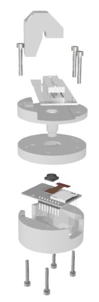
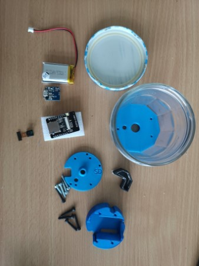
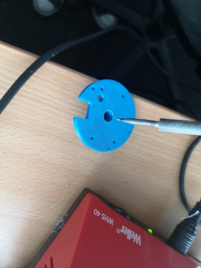
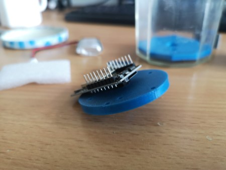
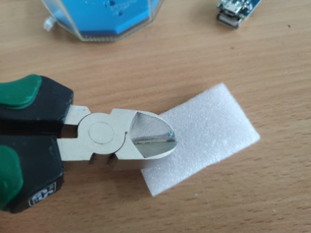
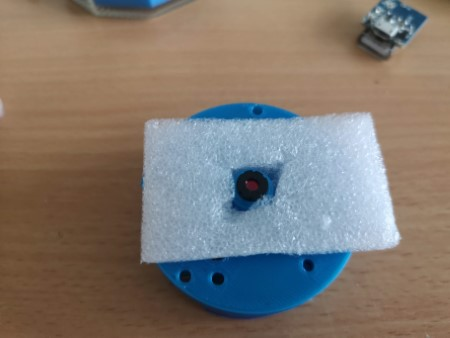
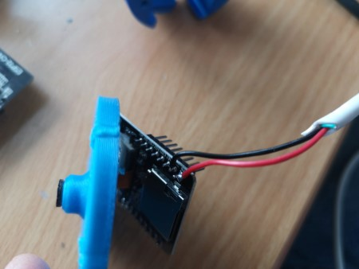
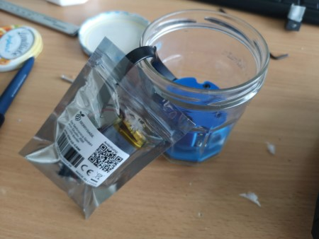
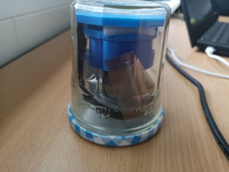
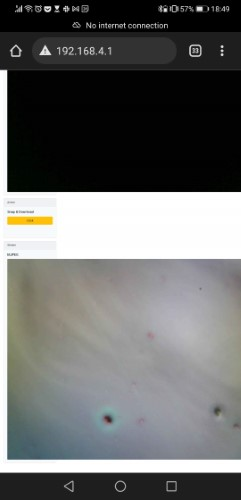

# Anglerfish

The **Anglerfish** is a derivative from the **Matchboxscope**. It has a "Angel" (German: fishing-rod) for hunting microbes, fishes, bacteria, algae...that can grow on a surface - under water! Yes! We want to capture the biofilm that will grow on transparent surfaces over time under water to get an idea what's happening. The core idea is to build an ESP32-based microscope, which fits into a watertight container. You focus it once to see the furface of the container sharp and release it into the wild, where it will capture images periodically.

While designing the Anglerfish - which actually looks like an anglerfish considering the "Angle" - we experimented with many different design configurations and consdierations.

There are great threads on building watertight assemblies using PVC tubes (LINK) or 3D rinted parts (LINK, PRUSA). However, one day (actually during cooking something) we came across the idea of using jars from jams.

A [quick survey](https://twitter.com/OpenUc2/status/1528406118816534529 ) led to the point that most countries have Bonne Maman jars in their supermarket shelves. An ideal starting point for frugal microscope submarines! Still curious? Continue reading! :-)

The **Anglerfish** shares many aspects with the **Matchboxscope**, hence it may be worth to also have a look [here](Matchboxscope.md)

***NEW !!!!*** We have a Youtube Video hat guides you through the process of building your own Anglerfish: https://www.youtube.com/watch?v=XuOOWYZesqA&feature=youtu.be

# Assembly

We will give you a step-by-step guide how to assemble the hole microscope. If anything fails or doesn't match as expected (most likely), please file an issue immediately. We will be there for you. Most of the steps below are very similar to the [Matchboxscope](Matchboxscope.md). only the way the screws for focusing the sample are oriented differently.

## Making it watertight

The jar is fun and all nice, but what if the glass shatters? Instead, we used one of these boxes [EMSA Clip & Close Frischhaltedosen 3-teiliges Set](https://www.hygi.de/emsa-clip-close-frischhaltedosen-3-teiliges-set-set-besteht-aus-3-x-550-ml-dosen-pd-65696?mcid=5&gclid=Cj0KCQjwn9CgBhDjARIsAD15h0AR1kv-CK-d5B0NS87yTNlyONGaPSpytpoQoar5avWwBswPgikKLVAaAgFZEALw_wcB). They have been proven to be 100% waterproof! Yay!

In order to observe biofilm growth on the surface, we need to add the "angel" or the illumination. For this the 3D printed holder that adapts the toslink fiber has to be added to the lid of the enclosure. We use hot glue, but need to make sure the surface is roughened in order to be sticky. For this we use sandpaper:

Once, done, the assembly, with the ESP32-based microscope inside the lunchbox looks like this:

## Components

This you will need for your device in order to work:

### Bill of material

Part |  Purpose | Source | Price |
:----------------:|:------------:|:----------------:|:------------:
ESP32-CAM (MB)+USB board | Better get two, one may break.. |  [Ebay](https://www.ebay.de/itm/274841850465?var=575090963555)| 6-15€
USB Micro Cable ||| 1€
M3 Screws (Cylindrical head, 15mm, 8mm)|||
3D printing material (PLA) |||
Aluminium foil (sticking if possible)|||
Sticky tape |||
Springs |||
Bonne Maman glass (empty) ||| 0€
TP5400 USB/LiIon Adapter | For charging the battery/powering the ESP|  [Ebay](https://www.ebay.de/itm/143958030411?mkcid=16&mkevt=1&mkrid=707-127634-2357-0&ssspo=tg9hdLAtSmS&sssrc=204

## 3D printing files

All design files can be found in the folder [INVENTOR](./INVENTOR).

All 3D-printable files can be found [here](./STL/Anglerfish_JAR):

* Anglerfish_JAR_Anglerfish_Jar_Adapterplate_v1_12.stl
* Anglerfish_JAR_Anblerfish_middle2_v1_1.stl
* Anglerfish_JAR_Anglerfish_bottom_v0_2.stl
* Anglerfish_JAR_Anglerfish_Lightperiscope_long_V0_21.stl

## Assembly Process

These are the parts you need

### Removing camera lens

Be careful! This is the most crucial part! Hold the camera sensor and unswrew the lens. Try not to touch the Flatband cable.

### Mount the camera lens in the tube

If the tube doesn't match the diameter of the lens, warm the plastic to make it bendable.

Add the camera sensor to the hole. It should be "pressfit".

The flatband has to be folded in the next step. Be careful: It may break and ruin the camera

### Assembling the case

Close the casing with M3x20 screws

For adding a "spring-loaded" mechanism, use the foam in the packaging of the ESP32 and cut a hole into the center

Add the foam to the lens-tube assembly

Add the baseplate to the JAR. This should be "press-fit"; if it doesn't work out of the box, place the jar on a hotplate (stove) and warm it up to ~50-80°C, gently push the plate as close to the glass as possible.

### Assembling the electronics (optional)

Alternatively you can use a small powerbank that fits into the assembly.

Solder a USB cable or siply two wires to the 5V/GND of the ESP32 on one end. The other end goes to the large USB or 5V/GND of the TP5400. This is the supply voltage.

The Litium Ion battery will be connected to the TP5400 input (B+/B-)

Make sure you do not create a shortcut! => Place everything in plastic bag.

### Microscope in the bottle => focus!

Mount the camera assembly to the jar baseplate:

Adjust the focus by first turning on the ESP32 and connect to the Wifi (`SSID: Matchboxscope`). Open the page http://192.168.4.1. Make a mark on the glass surface in front of the objective lens (has to be removed afterwards!). Turn the three focusing screws such that you create a sharp image of the mark on the glass.

### Final assembly

Put everything together and close the lid. Only connect the USB cable if you are close to your experiment.

Mount the LED with hotglue (use a lot)

## Setting up the software

Comming soon

