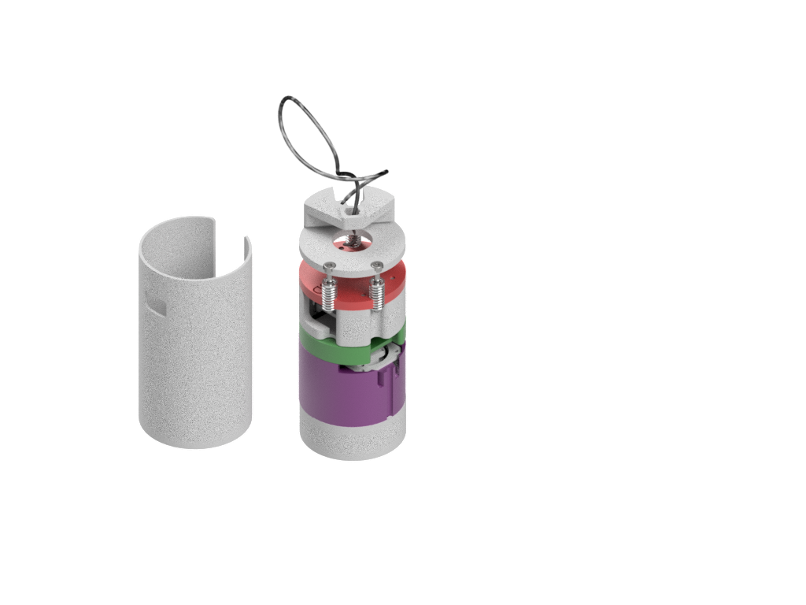
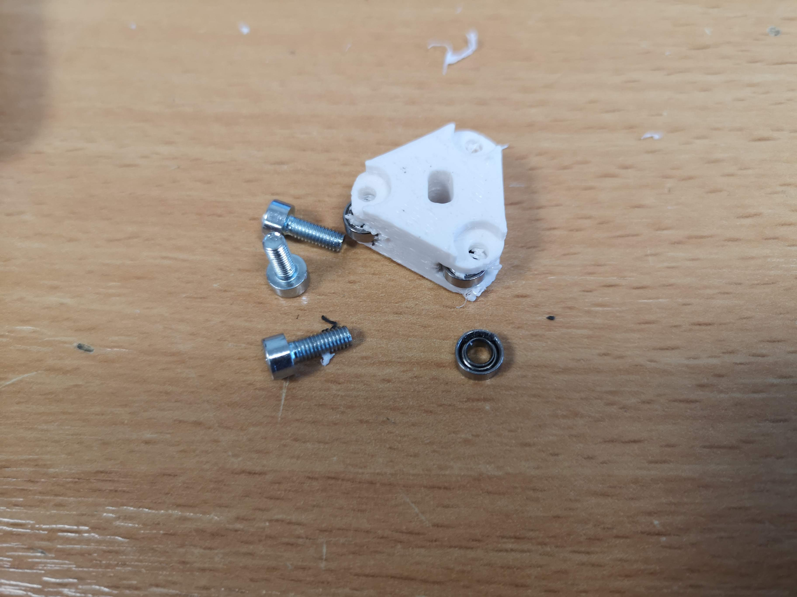
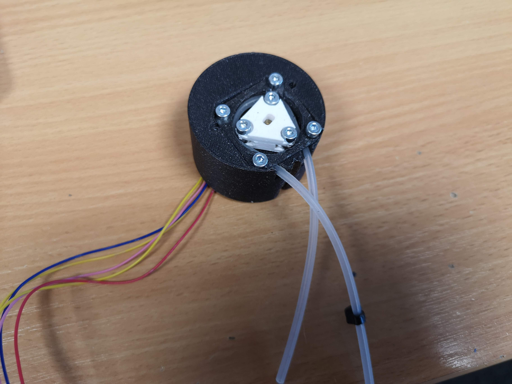
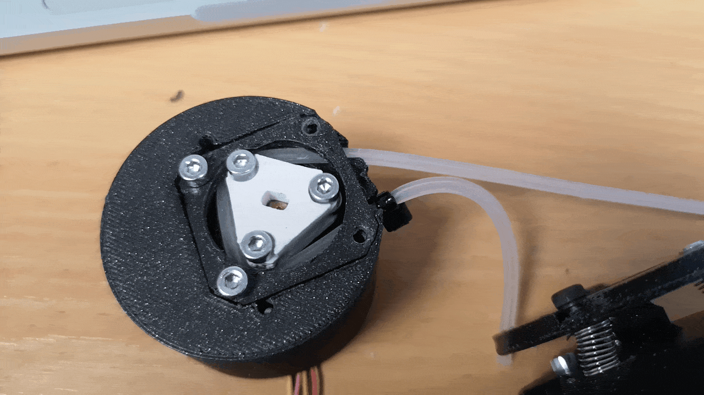
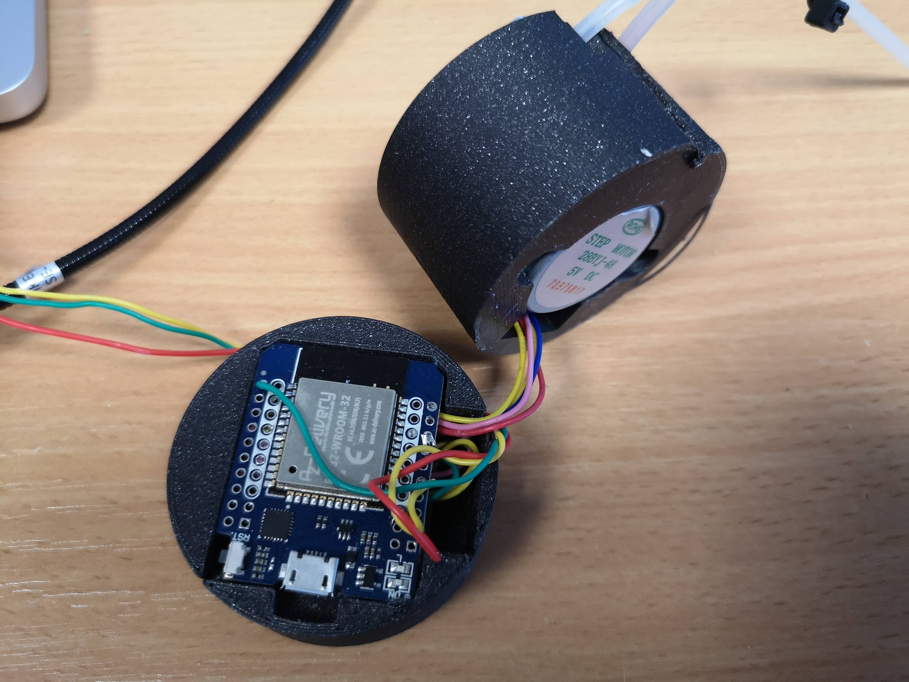
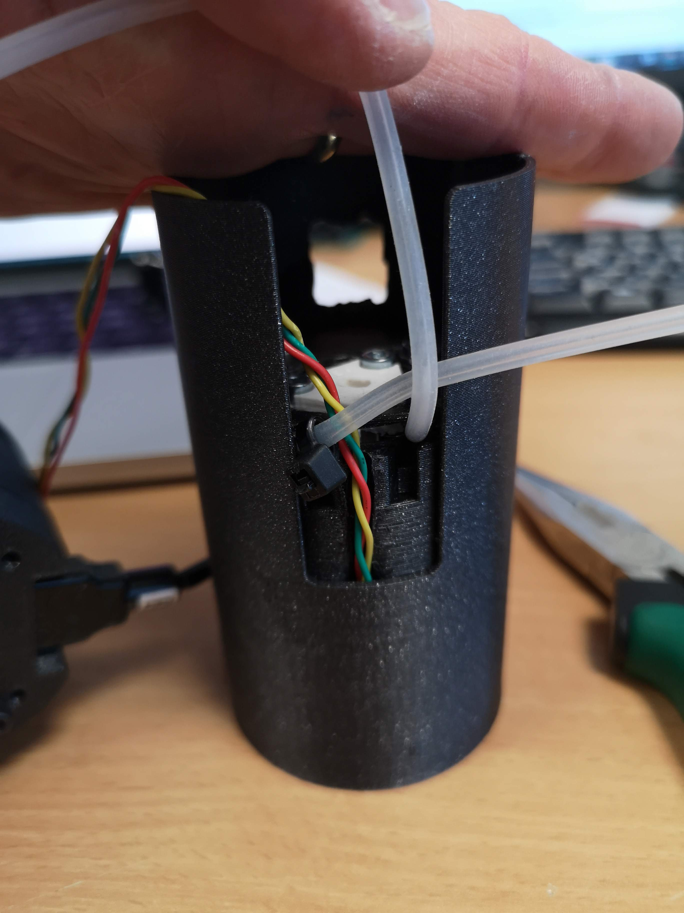
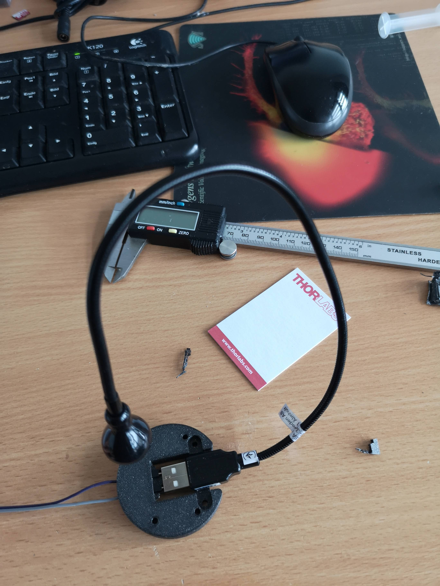
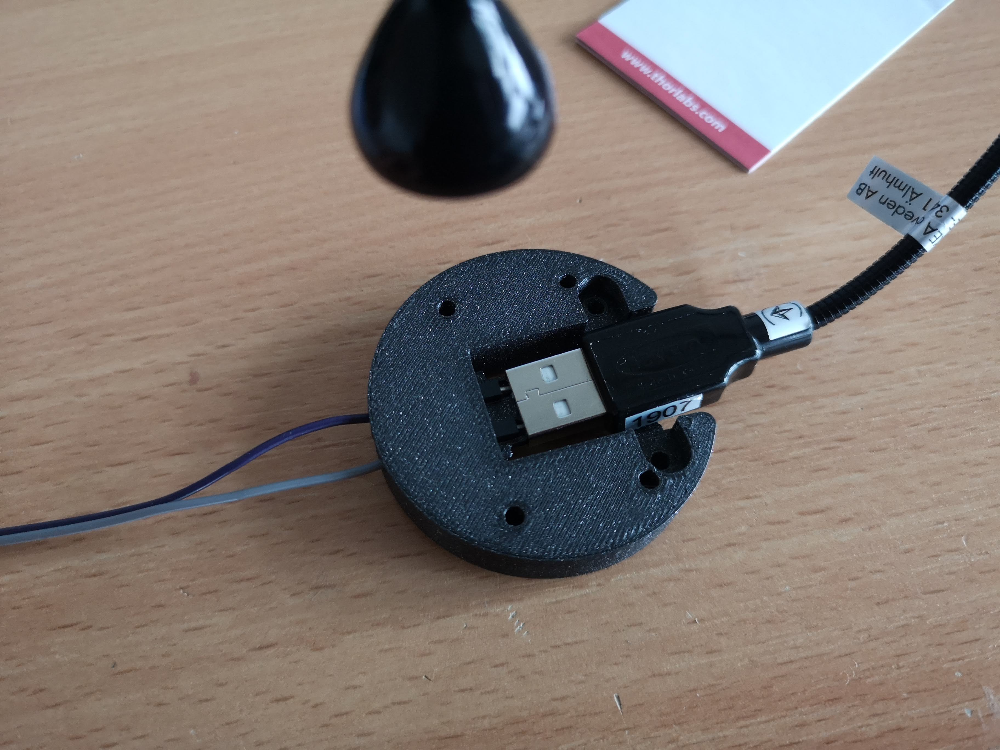
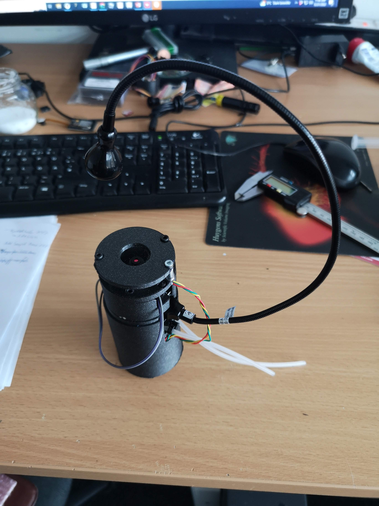

# Fluidiscope

Microscopy is a key tool in many scientific fields, including medical research, environmental monitoring, and materials science. However, current microscopy techniques often have limitations in terms of accessibility, flexibility, and high-throughput sample monitoring. To address these challenges, we developed an ESP32-based microscope with a peristaltic pump module for continuous or controlled flow. It can be used for microplastics, yeast, plankton... find it out! :)

Traditional microscopy techniques often require specialized expertise, expensive equipment, and limited flexibility. Furthermore, high-throughput sample monitoring can be challenging using traditional microscopy methods. To overcome these limitations, we designed an **ESP32-based microscope with a peristaltic pump module*** to enable continuous or controlled flow. The microscope is equipped with a decent camera module for high-resolution imaging and real-time video capture. The peristaltic pump module is added to the microscope assembly using a tube that adapts to the pump. A second ESP32 is used to control the stepper motor 28byj-48, which drives the pump.

# Assembly

We will give you a step-by-step guide how to assemble the fluidics part. The microscope (i.e. [matchboxscope](docs/Matchboxscope.md) remains the same. If anything fails or doesn't match as expected (most likely), please file an issue immediately. We will be there for you.
**Illumination:** Since we wanted to try different illumination scenarios, we added the IKEA USB Lamp to the assembly. It'S powered by the ESP32 USB.

*The Teaser*
{ width="400" height="300" style="display: block; margin: 0 auto" }

*The Rendering*


*In Reality*


## Components

This you will need for your device in order to work:


### Bill of material

(only for the perestaltic pump)

Part |  Purpose | Source | Price |
:----------------:|:------------:|:----------------:|:------------:
ESP32 D1 mini | Controls the pump, receives PWM signal 0..3V3 (fwd/bwd/0) |  [AZ](https://www.azdelivery.de/products/esp32-d1-mini)| 10 €
Ball bearing 8x3mm |Push the tube || 0.5€
3D printing material (PLA) |||
Ikea USB lamp | Variable Illumination | [ikea](https://www.ikea.com/de/de/p/jansjoe-led-leuchte-usb-schwarz-70291232/)| 5€
28byj-48 + ULN2003 | Rotating Stepper Motor |  [Amazon](https://www.amazon.de/Elegoo-Stepper-Schrittmotor-28BYJ-48-Treiberplatine/dp/B01MEGIHLF) | 5€
5mm silicone tube | for the perestaltic |  [???](None) | 0.5€


## 3D printing files

All design files can be found in the release from the [Matchboxscope Releases](https://github.com/Matchboxscope/Matchboxscope/releases/tag/ESPMicroscopeCollectionv2) (Look for miniplanktoscope).

All 3D-printable files can be found [here](./STL/Anglerfish_JAR):


## Assembly Process

These are the parts you need


Assemble the perestaltic pump. Add the M3x8 DIN906 to the rotating head and mount the 8x3mm bearings:



Screw the Stepper motor to the pump-base with M3x12mm screws


Add the perestaltic head to the motor shaft


Add a tube that fits the assembly (e.g. 5mm silicon), mount zipties to the ends of the inlet/outlet, so that when rotating the motor, the motor, the tube won'T run away


Add the lid and fix it with M3x12mm screws;




The wiring should look like this. Follow this tutorial for the wiring; You can choose almost any pin configuration. The code we will use later can be found [here]:


The motor will get the PWM signal from the camera and controlls the motor's rounds per miniute acoordingly:
The in1-4 pins on the ULN2003 can be 32,25,22,27 as stated below.
The "analogIn" was chosen to be 4.


In code:

```cpp
#include <Stepper.h>

const int stepsPerRevolution = 2048;  // change this to fit the number of steps per revolution

// ULN2003 Motor Driver Pins
#define IN1 32
#define IN2 25
#define IN3 22
#define IN4 27

#define analogIn 4

// initialize the stepper library
Stepper stepper(stepsPerRevolution, IN1, IN3, IN2, IN4);

void setup() {
  // set the speed at 5 rpm
  stepper.setSpeed(10);
  // initialize the serial port
  Serial.begin(115200);
}

void loop() {
  // read analog value from the potentiometer
  int nAverage = 20;
  long valSum = 0;
  int val = 0;
  for(int iAverage = 0; iAverage<nAverage; iAverage++){
    // we use PWM, so we have to create some kind of mean..
    valSum += analogRead(analogIn); // 0..4095

  }
  val = (float)valSum/(float)nAverage;
  Serial.println(val);

  // if the joystic is in the middle ===> stop the motor
  if (  (val > 2000) && (val < 2100) )
  {
    // STOP
    Serial.println("STOP");
    digitalWrite(IN1, LOW);
    digitalWrite(IN2, LOW);
    digitalWrite(IN3, LOW);
    digitalWrite(IN4, LOW);
  }

  else if (val >= 2100)
  {
    // map the speed between 5 and 500 rpm
    int speed_ = map(val, 2100, 4095, 1, 15);
    // set motor speed
    stepper.setSpeed(speed_);

    // move the motor (1 step)
    stepper.step(1);
  }

  // move the motor in the other direction
  else
  {
    // map the speed between 5 and 500 rpm
    int speed_ = map(val, 2000, 0, 1, 15);
    // set motor speed
    stepper.setSpeed(speed_);

    // move the motor (1 step)
    stepper.step(-1);
  }
}
```


Make sure the motor runs freely (for this, simply connect the motor driver board to the ESP, e.g. following this [tutorial](https://randomnerdtutorials.com/esp32-stepper-motor-28byj-48-uln2003/) and try a sample code for teh arduio IDE)




Hide all the cables



Put it close together, organize the wires and tubes


Add the tube and make sure the wires are leaving the assembly like this:



### Some thoughts on the Ikea Lamp

This is inspired by the https://www.thingiverse.com/thing:5167475 design, where Dupont cable were added to a 3D printed assembly in order to mimic a female USB plug. To be honest, it's much more straightforward to simply by a female adapter and solder it to the board using some wires - but: I didn't have one, so I created this layer for the lamp. It wasn't straightforward to add the ikea lamp - so: **WARNING** Better buy one of these and solder it to the ESP 5V/GND :)






And all mounted together:




**Done!!!**


# Software

More to come here?
