# Matchboxscope

This device is not much larger than a matchbox (hence its name - surprise..). Besides the ESP32-CAM it only needs 3D printed components, screws, aluminum foil, and a couple of magnets (or optional springs).
Below, we will guide you through the process of building the full device

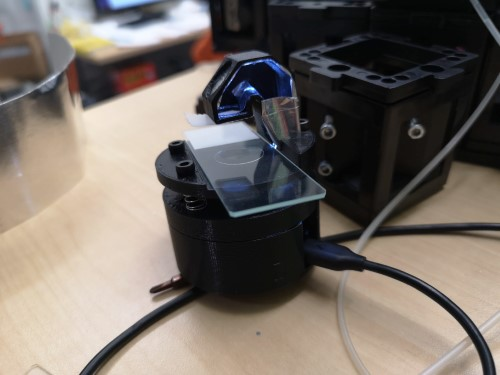

The Matchboxscope needs some 5V juice from USB and can work using a power bank. It has wifi capabilities, and it can live stream to whatever device you want :) 

## Z Stage 

In the Matchboxscope, the Z stage is controlled by magnets and by three screws. The magnets between the middle part and the top part are repelling each other and, in this way, keeping the sample stage in place: 

If you are, somehow averse to magnets, you can also use springs. In this case, we suggest using a nut for safety (and not shooting the spring-loaded glass slide in the sky). 

## Components

This you will need for your device to work:

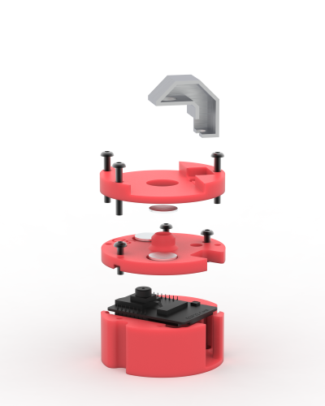

### Bill of materials

Part |  Purpose | Source | Price |
:----------------:|:------------:|:----------------:|:------------:
ESP32-CAM (MB) | Min board| Aliexpress | 6€
USB Micro Cable |Connection|Aliexpress| 1€
M3 Screws (Cylindrical head, 20mm, 12mm)|Structural|Hardware store|
Allen key 2.5 |Z focus|Hardware store|
3D printing material (PLA) |Structural|3D printing store|
Aluminum foil or silver spray paint |Structural|Craft store|
Neodymium magnets round 12x2 or 12x3|Structural|Aliexpress|
Springs (for the spring version) |Structural|Hardware store|

## 3D printing files

All 3D-printable files can be found [here](https://github.com/Matchboxscope/Matchboxscope/tree/master/STL/Matchboxscope)

The Matchboxscope is composed of three parts:

The bottom part, a case for the ESP32 board

The middle part, which acts as a spacer between the lens and the camera sensor

The top part (the sample part) holds the glass slide and the illumination periscope.

# Assembly of the microscope

A video of the build can be found here: [here](https://www.youtube.com/watch?v=iw_hoDRlnpg)  

Before starting, please check for updates at the end of this page.

Once you have obtained the parts, the assembly can be done in 5 minutes. 

You need: the ESP32 cam, the 3D printed parts, 3 M3x20 or M3x25 screws, 3 M3x16 screws, 12x2 or 12x3 neodymium magnets, superglue, M3 Allen Key, plier, and tweezers. 

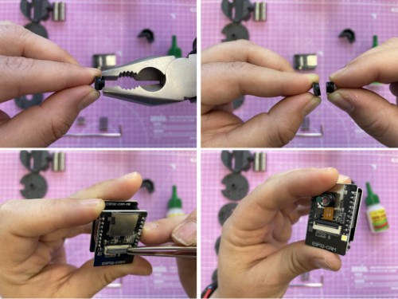

With a plier and very gently unscrew the lens from the ESP32 camera and, if not connected yet, connect it to the board. 

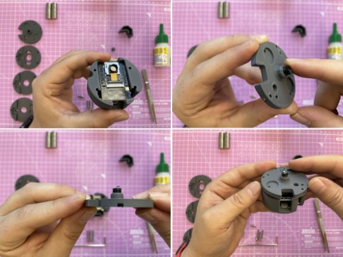

Put the lens on the 3D-printed "middle" part and the board in the 3D-printed "bottom" part. Alling the middle part and the bottom part. 

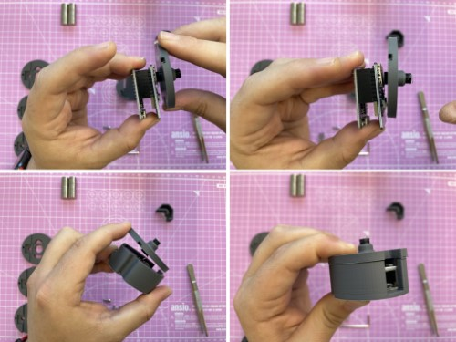

Once aligned, push the middle part to fix the camera on the 3D-printed part. Once the camera is in the 3D-printed middle part, bend the cable to align the two 3D-printed parts. 

Screw the two parts using 3 M3x16 (or M3x12) screws, and glue the magnets in position (both with polarity pointing in the same direction) 

Glue the other two magnets on the 3D-printed sample part, and remember that the magnet should repel the ones on the middle part. 

Screw the M3x20 in position and attach the illumination periscope. If needed, add more magnets to make the repulsion sturdier.

And here you go. Enjoy your new tiny scope. Use an extra magnet to keep your slide stable on the holder. 

## Assembly of the illumination unit

The idea of the illumination unit is to re-use the LED torch that is mounted on the ESP32-CAM and can be controlled through GPIO4. Don't look directly into the LED. As I said, it's bright!

One option is to glue or stick aluminum foil in the "periscope". Another option is to use silver spray paint to paint it (or use any silver paint you want). Both options worked fine: 

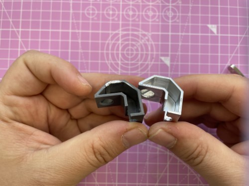

Print the little periscope and add aluminum foil inside the little channel, but keep the round holes open. Double-sided sticky tape will help you to mount the aluminum foil. Alternatively, use self-sticky aluminum foil. Tweezers help you in the process of placing the foil.

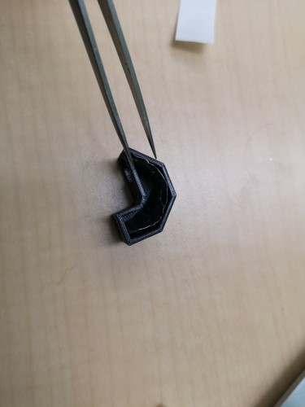

You can also seal the "light channel" with additional aluminum foil. A small piece of diffuse Sticky-tape/scotch tape (3M) on the end of the channel will make the illumination much smoother but is not necessary (actually not visible on the photo).

## Pictures taken with the Matchboxscope

*div=0.01mm*

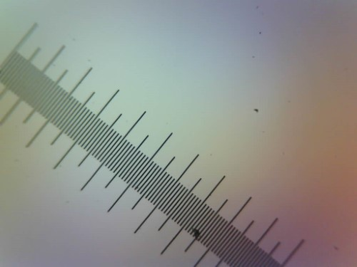

*Rotifer*

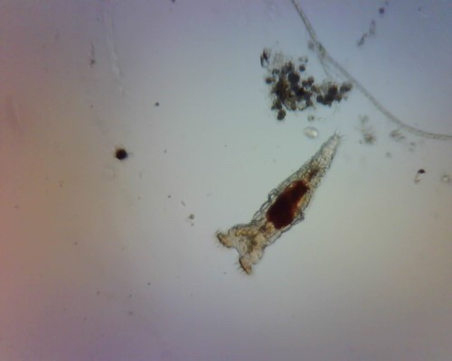

*Mosquito larvae*

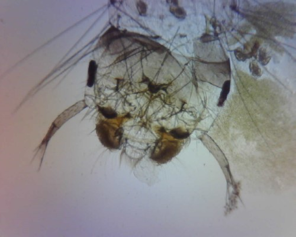

*Rotifers and Tardigrade*

And a video recorded from the Matchboxscope is [here](https://www.youtube.com/watch?v=x27QPLMVoFQ)

# Updates 

*update Feb 2023 - You can 3D print a spacer for the camera on the board. This spacer will alleviate the cable stress. You can find the file in the stl folder. 

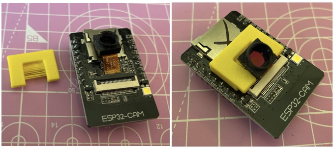

*update March 2023 - We have found these M3x30 screw with a flat part. Being in contact with the 3D-Printed top part for the Z focussing, they work better because of less friction.

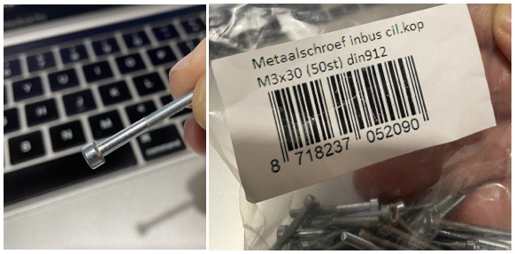