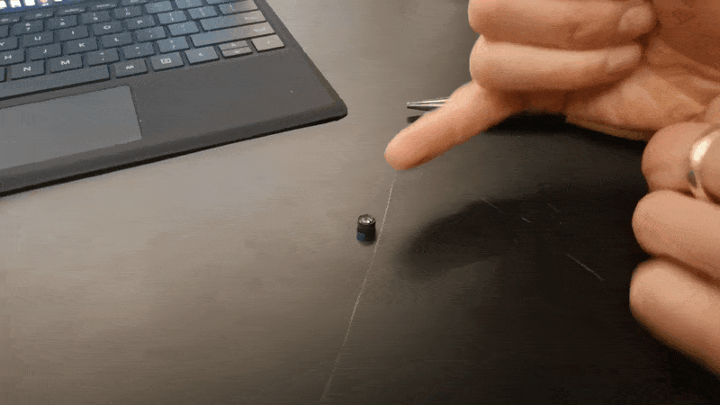

# Matchboxscope (Injection Molding Version)

This is a simplified version of the matchboxscope that can be produced using a desktop injection molding machine.

## todo
- disconnect usb
- short screw lens
- safely unplug the lens
- add sticky something to lens holder
- correct screw sizes
- spring mechanism

## improvements
- hole for led holder larger
- really threaded inserts?


## Flash the firmware

1. Connect the ESP32-CAM board to the USB and press the ***RESET*** (in the rear of the ESP32-CAM board) and ***BOOT*** (or sometimes ***IO0***) button (on the USB-side). Then first release the ***RESET*** and then the ***BOOT*** button. The device will be in `download mode`

2. Go to https://matchboxscope.github.io/firmware/FLASH.html and select the `ESP32 Camera Simple Webcam Server Advanced` firmware


3. Hit the `Connect` button and select the ESP32-CAM


4. Select `Install ESP32...`


5. Hit `Install`


6. Wait for it...


7. Open the serial Minitor afterwards and hit the ```RESET```button on the ESP32


8. The output should look something like this


9. By default the ESP32 will connect to a WIFI hotspot using the following default networks:

```
SSID: Blynk
PW: 12345678

SSID: omniscope
PW: omniscope
```

You can add your own by pasting the following string in the serial monitor
```
{"ssid":"youssid","password":"yourpassword"}
```

The firmware is based on this code: https://github.com/Matchboxscope/matchboxscope-simplecamera/tree/matchboxscope

10. finding the ESP in the network may become tricky. You can install the Fing APP (https://play.google.com/store/apps/details?id=com.overlook.android.fing) and scan your local network for its IP. In case you prepared an access point (AP) using Windows, you can spot the IP address in the hotspot  settings.

### Creating an access point / wifi hotspot

You can use the Android AP or Windows hotspot, perhaps also the iPhone thingy to create an access point with the following credentials:
```
SSID: Blynk
PW: 12345678
```
and the ESP32 will automatically connect

The log will look like this:

```
Connecting to Wifi Network 1: [F6:D1:08:4A:51:F0] Blynk
[ 13000][V][WiFiGeneric.cpp:97] set_esp_interface_ip(): Configuring Station static IP: 0.0.0.0, MASK: 0.0.0.0, GW: 0.0.0.0
.[ 13632][V][WiFiGeneric.cpp:355] _arduino_event_cb(): STA Connected: SSID: Blynk, BSSID: f6:d1:08:4a:51:f0, Channel: 1, Auth: WPA2_PSK
[ 13633][D][WiFiGeneric.cpp:931] _eventCallback(): Arduino Event: 4 - STA_CONNECTED
[ 13674][V][WiFiGeneric.cpp:369] _arduino_event_cb(): STA Got New IP:192.168.137.217
[ 13675][D][WiFiGeneric.cpp:931] _eventCallback(): Arduino Event: 7 - STA_GOT_IP
[ 13678][D][WiFiGeneric.cpp:996] _eventCallback(): STA IP: 192.168.137.217, MASK: 255.255.255.0, GW: 192.168.137.1
.Client connection succeeded
IP address: 192.168.137.217
Netmask   : 255.255.255.0
Gateway   : 192.168.137.1
Setting httpURL
Setting up OTA

No OTA password has been set! (insecure)

[ 16024][I][ArduinoOTA.cpp:141] begin(): OTA server at: Matchboxscope.local:3232
Added HTTP service to MDNS server
Time functions disabled
Starting web server on port: '80'
Starting stream server on port: '81'

Camera Ready!
Use 'http://192.168.137.217/' to connect
Stream viewer available at 'http://192.168.137.217:81/view'
Raw stream URL is 'http://192.168.137.217:81/'
Camera debug data is disabled (send 'd' for status dump, or any other char to enable debug)
```


Go to the device's ip address, in this case  http://192.168.137.217/ and open the stream.
### Troubleshoot

#### Not connecting
Possible causes:
- Did you install the driver/is the driver installed (Usually it's preinstalled in Windows/Mac)
- Antivirus software running?
- USB Cable is actually a data-cable not a charging-only cable?

#### Stream stops
- lower the resolution (e.g. VGA)

## Assembly

These are the parts you need to build a Matchboxscope:


- ESP32-Camera board + USB Serial adapter
- 2x Lid/bottom (printed)
- 2x Base (printed)
- 1x camera holder (printed)
- 1x lamp holder (printed)
- 1x lens holder (printed)
- 1x led lamp
- 3x Springs
- 8x M3x20 Cylindrical Headed Screws (DIN912)
- 6x M3 threaded inserts (4x6mm)
- 1x USB micro cable


1. Add the threaded inserts to the base using a hot iron - don't burn yourself! Hint: You can have 3 inserts on the top and three on the bottom. A hot iron with a fine tip is better than one with a flat one.


2. Repeat this for all 6 slots (or 5 if you only use 2 on the bottom)


3. Remove the lens from the camera module using pliers


**HINT:**


4. Add the lens to the holder and remove the sticky tape


**HINT:**


5. Fix the lens on the base using M3 screws


6. Add the camera holder to the board and fix the camera in place


7. Add the esp32 board to the base


8. Close the lid using M3 screws


9. Add the springs to the screws and mount the sample plate using m3 screws + add teh lamp holder


**HINT:** 


10. Add the lamp - done!


## Done


## Showcase


