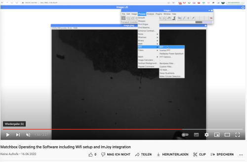

# ESP32-Based Microscopy

This is a repository for the smallest standalone low-cost open-source DIY microscope system that can be used for a gazillion different applications. Sounds interesting? Continue reading!

The core component of this device is an ESP32 microcontroller packed with a small Camera (OV2460), WiFi, and a microSD card slot, making it a perfect match for your microscopy project. In its minimal version, you only need the ESP32-CAM and perhaps some chewing gum to raise the objective lens and create a finite corrected microscope.

Why raise the lens, and what is a finite corrected microscope, you ask? 

## Some theory

### Magnification

*Why can you actually magnify?* Good question! We don't magnify at all, but since the pixels of the OV2460 camera are really small, and we use the objective lens with a relatively small focal length (f'=~5mm), we perform a "4f-imaging". In this context, this means, we have a sample at a distance of 2f (focal lengths) in front of the lens, which will, in turn, create an image at 2f away from it. The camera chip will digitize the image and send it over to your displaying device. You can tune the magnification by changing the distance between the sample-lens and the lens-sensor. The formula is given by:

`M=a'/a`, where `M`is the magnification, `a'` the distance sample-lens, `a` the distance lens-sensor. Further:

`1/f'=1/a' - 1/a`;

You can easily display your phone's screen's ~100µm sized pixels. By tuning the distance, you can play with the field of view, resolution (since the imaging NA changes), and magnification. We don't care about sampling right now, since we do not have much influence on it anyway...

Essentially, this configuration is also known as a finite-corrected microscopy arrangement. It comes with many problems, but we want to keep it simple. Hence we will stick to the basic optical setup here.

### Illumination

The other important part of any microscope is the illumination setup. And also in this case, the ESP32-Cam board is coming to our help.

*Why don't we need any illumination?* Yet another good question. Where there is no light, we won't see anything. Obviously. But: The ESP32 has an insanely strong LED Torch/light that can be switched on/off and even dimmed. Luckily, we can use it to illuminate our sample for transmission microscopy. Wait, how can that be done? Easy! We construct a little periscope/mirror-periscope that simply reflects the light on top of the sample. We have also used other illumination systems like a fiber optic or an Ikea USB LED. The versatility of the system is amazing.

This is how the first periscope illumination looked like. Like an Anglerfish...

However, we wanted to make the microscope a bit more practical and created some 3D printed parts that will realize the following devices:

**The Anglerfish**: This device is well preserved in your beloved jars and hence watertight. Why? Throw it in your nearby pond and collect data how microfilm grows on the jars' surface. Fun! Follow the [**BLUE PILL 🔵**](Anglerfish.md)

**The Matchboxscope**: This is a simple self-contained microscope e.g. for tacking snapshots of your microfluidic chips, your parasite containing slides or just for fun. It comes with a minimum number of parts, but offers a spring-loaded z-stage. Also idea for your incubator-contained microscopy experiments! Follow the [**RED PILL 🔴**](Matchboxscope.md)

**The Z-Stacker**: It adds an automatic focussing unit to the *Matchboxscope* in order to create temporal Z-stacks of your beloved cell cultures. It needs more electronics, but still relies on the ESP32-CAM only. Lots of fun, too.  Follow the [**GREEN PILL 🟢**](Matchboxscope.md)

Still curious? *Continue Reading by clicking on individual device sub-pages!*

### How to install

In order to get the code compiled and uploaded to your ESP32 camera board, a number of steps have to be carried out to prepare the system.

#### Compile and Upload

This code is written for the `AI_THINKER`

1. Download the Arduino IDE 1.8.X from [here](https://arduino.cc/)
2. Install the ESP32 IDF tool through the arduino board manager; Add the following link to the settings (a more in-depth tutorial can be found [here](https://randomnerdtutorials.com/installing-the-esp32-board-in-arduino-ide-windows-instructions/):
`https://raw.githubusercontent.com/espressif/arduino-esp32/gh-pages/package_esp32_dev_index.json`
When installing the board, go for the version `2.0.3`
3. (*OBSOLTE!*) Install the ESP32Cam library following this [link](https://github.com/yoursunny/esp32cam) and their README
4. Clone this repository
5.
* *MatchBoxscope*: Choose the latest release for the MatchBoxscope, open the `.ino` and flash the project ([v0.1](https://github.com/beniroquai/Matchboxscope/releases/download/Matchboxscope/ESP32CAM-MatchBoxScope-MAIN.zip))
* *Anglerfish*: We will provide a ready-to-use software solution soon
* *IncubatorMicroscope*: We will provide a ready-to-use software solution soon
6. *Compiling*: Under `Tools`select your board (`DEV Module`), `port` and enable the `PSRAM` enable 4MB external PSRAM.
7. Compile and Upload

**ATTENTION for Android users:** The Wifi in access point mode (*AP*) does not offer internet, hence Android uses available cellular/mobile data and won't open the local address (`192.168.4.1`). *solution:* Switch off mobile data or disable `Wifi+`

**WiFi settings:**

Please have a look in the wifi-settings to adjust them according to your network configuration:

`cpp
boolean hostWifiAP = true; // set this variable if you want the ESP32 to be the host
const char* mSSID = "Blynk";
const char* mPASSWORD = "12345678";
const char* mSSIDAP = "Matchboxscope";
``

#### Upload files to SPIFFs

For the `HTML` and `CSS` files, you can upload the files to

# Software

## Anglerfish Code

Getting many images in an autonomous "diving" experiment is key. For this, we wrote a firmware that enables you to find the focus and as soon as you'Re done, the microcontroller goes into deep-sleep mode to save energy. The following steps are important to carry out before your experiment.

**The protocol**
1. Assemble unit and charge battery
2. Upload software and insert SD card
3. Then connect the battery to ESP32 and watch the camera stream via wifi and adjust the focus so that you can see the surface (of the jar) in focus. That's what the screws and springs are for. You do this once.
4. Either with a switch (awkward, because you have to solder), or via Wifi (switch in Webgui/HTTP endpoint), deactivate the focus mode.
5. Microscope goes into deep-sleep mode and wakes up every `X` minutes to take a photo and save it on the SD card.

In deep-sleep setting it consumes virtually no power.

**Problem/thoughts:**
- It is not possible to detect whether it is deep-sleep or disconnected from the power supply, so we built in this funny construct with the date/time of flashing the ESP32. So you can reset the EEPROM variable for focus mode (yes/no) when you (re-)flash the microcontroller
- the SD card and the LED flash hinder each other a bit because they both run on the same pins (yup). But I think we managed to get everything working by relying on the 1-bit mode of the SD card (slower, but more stable); also important: Initialize the SD card before any GPIO assignment (i.e. in `setup()`)
- The same code could also be used in an incubator-contained micoroscope, for example, to observe the growth of cells. But for this it would be important to keep the Wifi stream running :)

# Videos

That's the software for the Matchboxscope:

And a more in-detail tutorial on how to use the software:

## Get Involved

This project is open so that anyone can get involved. You don't even have to learn CAD designing or programming. Find ways you can contribute in  [CONTRIBUTING](https://github.com/openUC2/UC2-GIT/blob/master/CONTRIBUTING.md)

## License and Collaboration

This project is open-source and is released under the CERN open hardware license. Our aim is to make the kits commercially available.
We encourage everyone who is using our Toolbox to share their results and ideas, so that the Toolbox keeps improving. It should serve as a easy-to-use and easy-to-access general purpose building block solution for the area of STEAM education. All the design files are generally for free, but we would like to hear from you how is it going.

You're free to fork the project and enhance it. If you have any suggestions to improve it or add any additional functions make a pull-request or file an issue.

Please find the type of licenses [here](https://github.com/openUC2/UC2-GIT/blob/master/License.md)

REMARK: All files have been designed using Autodesk Inventor 2019 (EDUCATION)

## Collaborating
If you find this project useful, please like this repository, follow us on Twitter and cite the webpage! :-)
